```{r setup, include=FALSE}
knitr::opts_chunk$set(echo = FALSE, warning = FALSE, message = FALSE)
```

<style type="text/css">

.note, .warning {
  border:solid 1px #888;
  margin:10px;
  padding:8px 10px;
}
.note {
  background:#FFFAD0;
}
.warning {
  background:#FFDDDD;
}

.note span, .warning span {
  font-weight: bold;
}
</style>


# Motus Guidebook

This guide was designed to help both researchers and public collaborators access data available on Motus.org. It will be split into four distinct sections:

1. [Getting Started](#introduction)
2. [Exploring Data](#explore)
3. [Managing Data](#manage)
4. [Troubleshooting Data](#troubleshoot)
 
## 1  Getting Started  {#introduction}

<a href="#top" style='float:right;font-size:12pt;margin-top:-24pt;'>Back to top</a>

### 1.1 Registering a new user {#ch11}

Before you can create a new project or join an existing project, you must first create a user. This can be done by selecting **Register** at the top right of any page on the Motus website. You will also be given the option to register a user any time you try to access a page under 'Manage Data'. [Click here to register a new user](https://motus.org/data/user/new)
 
 
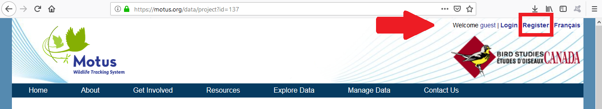


When creating a new user you will have the option to be a **Collaborator** or **Principal Investigator**. Any user requesting to be a **Principal Investigator** will require authentication by Motus staff. An email will automatically be sent to Motus staff upon registration for authentication.

\pagebreak

### 1.2 How data is organised

#### 1.2.1 Receivers

We define receivers as the computers used to collect data. In order to keep track of different station setups or different locations where an individual computer is used, we organize them into deployments. For instance, if you have a computer at a station and you had the antennas at that station pointing in one direction for the first month and then you changed their direction, you would need to have at least two deployments to identify when those antenna directions are changed.  You will need a new deployment for any of the following changes:

-	Antenna angle
-	Antenna height
-	Number of antennas
-	Antenna type
-	Location
-	Computer (receiver)

Data will often be displayed by receiver serial number (e.g.: *Lotek-6325*, or; *SG-5541RPI3E7F8*) and the Deployment ID (4-digit number). 

 
## 2  Exploring Data {#explore}

<a href="#top" style='float:right;font-size:12pt;margin-top:-24pt;'>Back to top</a>

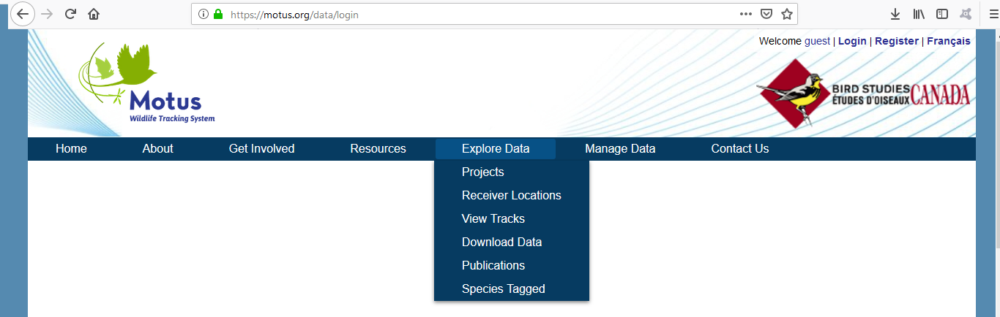

We provide a public interface for collaborators to explore data available in the Motus Network. This interface allows collaborators to view information about individual receivers, tags, and projects in the form of data summaries. To prevent your data from being publically accessible, you must set your project to private. See [Chapter 3.1.1](#ch311) for information on how to change your project's privacy settings.

There are several datasets publically available on the web interface and downloadable as a CSV file (comma-separated variable).

- [Projects](#ch21)
- [Receivers](#ch22)
    - [Receiver locations](#ch221)
    - [Receiver deployments](#ch222)
    - [Antenna deployments](#ch223)
- [Tags](#ch23)
    - [Registered tags](#ch231)
    - [Tag deployments](#ch232)
    - [Tag tracks](#ch234)
- [Species list](#ch24)
- [Field description](#ch25)
- [Publications](#ch26)


### 2.1 Projects {#ch21}

You can view a list of all projects registered to Motus by going to *[Explore Data > Projects](https://motus.org/data/projects)*. This same list can be downloaded as a CSV by going to *[Explore Data > Download Data](https://motus.org/data/downloads)* and selecting the appropriate option.

Each project has three links embedded within the table:

- [Projects](#ch21)
- [Receivers](#ch22)
- [Tags](#ch23)

Clicking on the project will bring you to a new page with more information about the project. This includes the projects description, list of researchers, and links to receivers and tags registered to the project.

---

### 2.2 Receivers {#ch22}


#### 2.2.1 Receiver Locations {#ch221}

You may view a map of receiver locations by navigating to *[Explore Data > Receiver Locations](https://motus.org/data/receiversMap)*. 

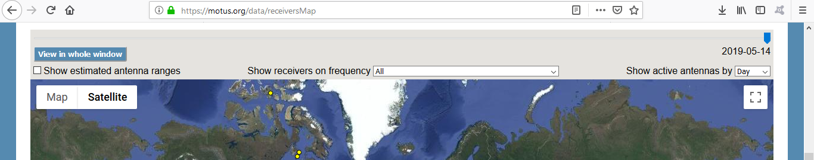
  
***

The interactive map can be viewed in full screen by clicking the button 'View in whole window'.

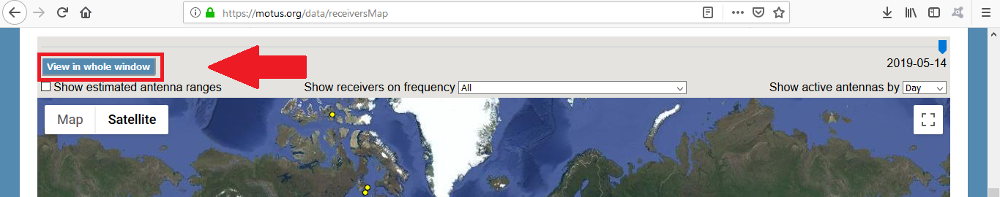

***

Only currently active deployments are displayed by default. This can be changed by moving the date slider located above the map.

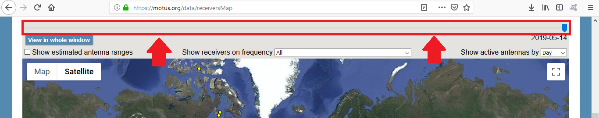
  
***

The resolution of the date slider can be changed by selecting an option from the dropdown menu on the right-hand side of the screen.

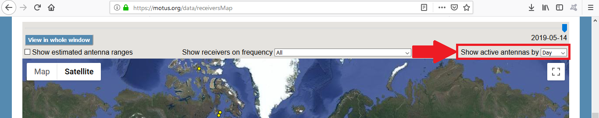
  
***

Select the checkbox on the left-hand side of the screen to display the estimated antenna ranges. 

<div class='note'>
<span>Note:</span>
These ranges are purely theoretical and do not take into account landscape features or weather.</div>

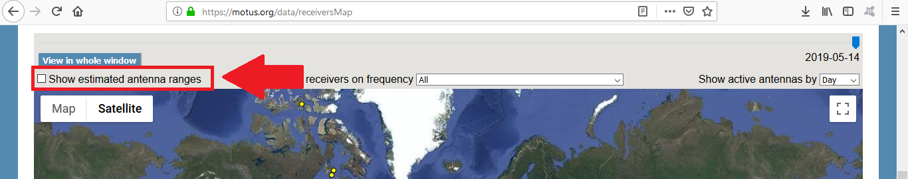
  
***

Finally, receivers can be filtered by frequency by selecting an option from the dropdown menu at the top-centre of the screen.

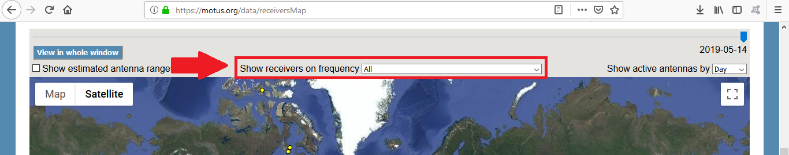  
  
***

Clicking on a receiver will give you a list of properties for that receiver. This includes all tags detected during that receiver deployment. You may view tags in a [table](#ch224) or a [timeline](#ch225).

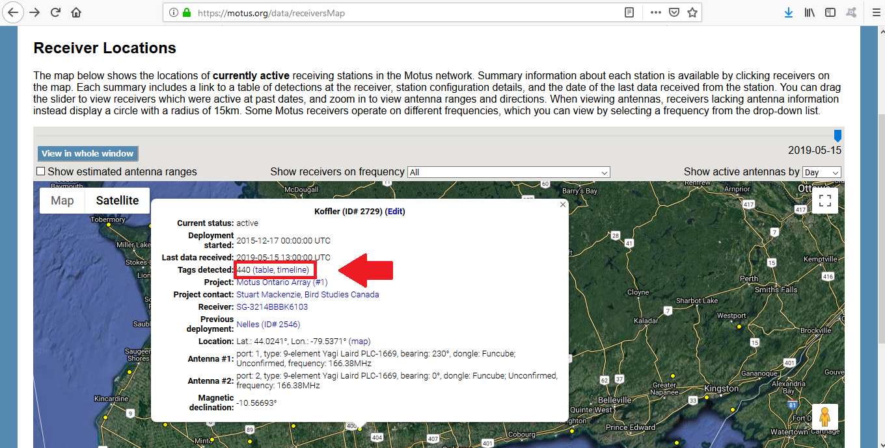  
  
***


#### 2.2.2 Receiver deployments {#ch222}

A list of all receiver deployments is available for download at *[Explore Data > Download Data](https://motus.org/data/downloads)* under **Receiver Deployments**. You can also view all receivers and the associated deployments for a given project by going to *[Explore Data > Projects](https://motus.org/data/projects)* and clicking on the 'Receivers' column of the project of choice.

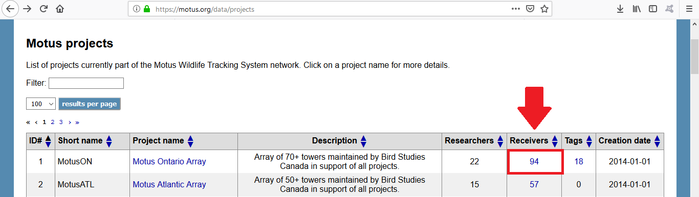

***

This will bring you to a table of all receiver deployments, both active an inactive ('terminated'). The **tags** column includes a link to a table of all tag detected during each receiver deployment.

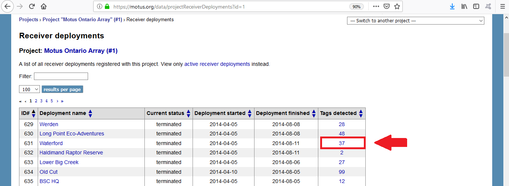

***

#### 2.2.3 Antenna Deployments {#ch223}

A list of all antenna deployments is available for download at *[Explore Data > Download Data](https://motus.org/data/downloads)* under **Antenna Deployments**.


#### 2.2.4 Receiver Deployment Tag Detections {#ch224}

You can explore tags detected during a given receiver deployment by selecting it from the [receiver locations map](#ch221), by clicking selecting the receiver from the 


##### 2.2.4.1 Receiver Deployment Tags Table {#ch2241}

You can view a table of tags detected during a given receiver deployment. This is a summary table of tags, with a row for every day each tag was detected. You can view more information about an individual tag deployment by clicking one of rows of the table. 

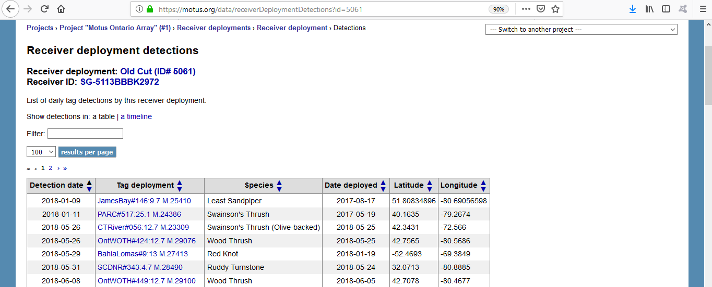

***

<div class='note'>
<span>Note:</span> 
These data are filtered to reduce the number of false positives appearing in these summaries. This may result in some true detections being omitted, but we determined this to be acceptable in order to avoid misinforming the public by presenting false positives.</div>


##### 2.2.4.2 Receiver Deployment Tags Timeline {#ch2242}

You can view a timeline of tag detections for a given receiver deployment. The timeline has the time of day on the X-axis and date on the Y-axis. Different coloured bars on the plot represent detections of individual tags. Hovering the mouse over the coloured bars will display information about that tag. There is also a list of all tags located below the timeline. 

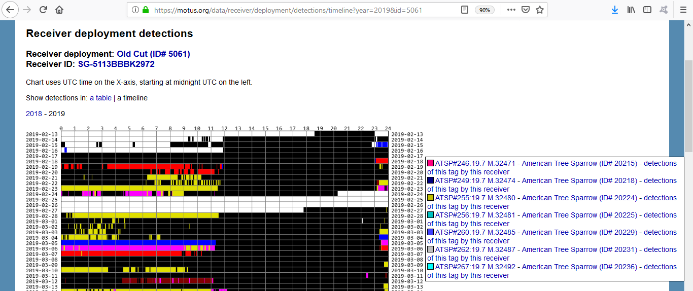 

***  

This timeline only shows data for a single calendar year at a time - you can select which year to display by clicking on one of the links located above the timeline.

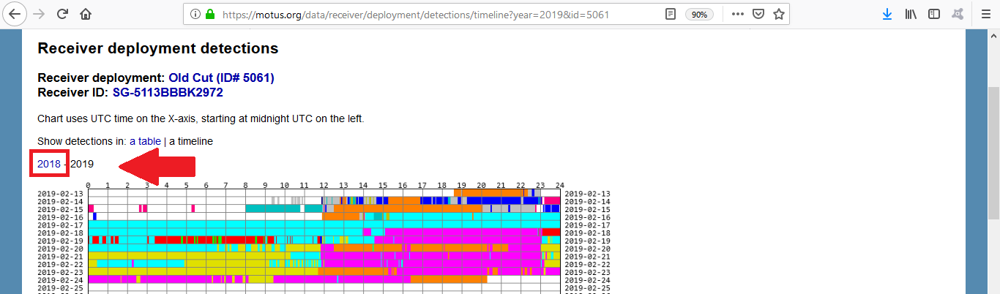

***  

<div class='note'>
<span>Note:</span>
These data are filtered to reduce the number of false positives appearing in these summaries. This may result in some true detections being omitted, but we determined this to be acceptable in order to avoid misinforming the public by presenting false positives.</div>


#### 2.2.4 Receiver Deployment Tags Table {#ch224}

You can view a table of tags detected during a given receiver deployment. This is a summary table of tags, with a row for every day each tag was detected. You can view more information about an individual tag deployment by clicking one of rows of the table.

### 2.3 Tags {#ch23}

Tags are the radio transmitters that are affixed to animals for tracking. These tags emit a coded 'burst' of radio pulses that encode a unique ID for that tag. There are a limited number of unique IDs that can be produced, however, making it necessary to find other way to expand the number of uniquely identifyable tags. This is done by also calculating the length of time between each coded burst, called the **burst interval**. Only prime numbers are used as burst intervals to eliminate the possibility of one interval resembling another, which limits the number of unique tags to just over 36,000. However, tags with longer burst intervals are more difficult to track manually and are less likely to be detected during a  fly-by, so most researchers opt for lower interval lengths. For this reason, Lotek has had to reproduce some tags to keep up with the demand. This makes it extremely important to ensure no two identical tags are deployed at the same time. This is another reason why it is essential that collaborators report when tags are being used. 

You can explore tags by project or receiver. To view tags for a specific project, go to *[Explore Data > Projects](https://motus.org/data/projects)* and click on the **Tags** column for the project you wish to explore. 

To explore tags by receiver, navigate to the receiver of your choice (see *[Explore Receviers](#ch22)*) and click on the links for either **table** or **timeline**. A tag 

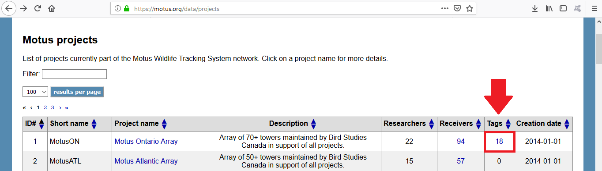

#### 2.3.1 Registered Tags {#ch231}

A list of all tags registered to Motus is available for download at *[Explore Data > Download Data](https://motus.org/data/downloads)* under **Tags**.


#### 2.3.2 Tag Deployments {#ch232}

A list of all tag deployments is available for download at *[Explore Data > Download Data](https://motus.org/data/downloads)* under **Tag Deployments**.

#### 2.3.3 Tag Tracks {#ch233}

You can view tracks of any combination of tags and projects by going to *[Explore Data > View Tracks](https://motus.org/data/tracksSearch)*. On this page you can filter for tags by date range, project, and species. After searching for tags, select any number of tags and then click **Make Map**. Please note that these maps have been created using broad filters based on theoretical flight speeds, logical geographic/time sequences, and at least three consecutive tag detections at each station. Due to the nature of this dataset, these tracks are not to be taken as 100% true.

To view prepared tracks for demonstration purposes, select any of the links located below the search form, under the header **Demonstration Maps**. These have been prepared by researchers and are best for public interpretation.

### 2.4 Species List {#ch24}

A list of all species recognized by Motus is available for download at *[Explore Data > Download Data](https://motus.org/data/downloads)* under **Species List**. This is includes all species, not just those with deployed tags.

### 2.5 Field Descriptions {#ch25}

For descriptions of all variables in all tables on the Downloads page, go to 
*[Explore Data > Download Data](https://motus.org/data/downloads)* and select **Field Descriptions**. 

### 2.6 Publications {#ch26}

We try to keep a list of all current publications that use or reference Motus. You can view this list by going to *[Explore Data > Publications](https://motus.org/data/publications)*.

## 3  Managing Data {#manage}

<a href="#top" style='float:right;font-size:12pt;margin-top:-24pt;'>Back to top</a>

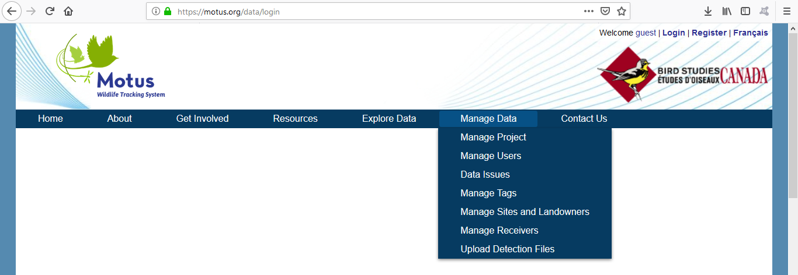

It is essential that collaborators maintain accurate and up-to-date metadata. Failure to do so may result in a number of issues that can go unnoticed for long periods of time. Your project's metadata is not only important for yourself, but for every other project that may use your equipment. For instance, a receiver with inaccurate antenna directions may provide false information on departure direction. Another common mistake is to not supply tag deployment dates until a long time after deployment which may result in missed detections.

In order to prevent mistakes and misinformation, it is important to follow these steps to ensure all your metadata is accurate and up-to-date.

Information will be organised as it appears on the Motus website.

### 3.1  Create a project {#ch31}

To create a project, you must be logged in as a Principle Investigator. See instructions on how to change your account type here: [Set Account Type](#ch1.1)

There are four different fields you can fill when creating a project:

| Field name | Field Description |
|------------|-------------------|
| Project Name | The name of your project that will appear on most public interfaces |
| Short Name | A short label of your project that will appear in some data outputs, such as receiver plots |
| Short Description | A short description of your project that will appear on public output when viewing a list of all project |
| Description | A detailed description of your project that will only be displayed when the project is selected from the list of all project |

### 3.2  Manage Project {#ch31}
  
This is where you 

#### 3.2.1  Project Data Availability {#ch311}
To set what data is publically available, go to [Manage Data](https://motus.org/data/project/edit) and under **Data Availablity** change the settings according to your preferences.


<div class='note'>
<span>Note:</span> 
This is especially important for collaborators who wish to conceal the location of tags and tag detections for rare species or when landowners do not want to have their location publically available.</div>

### 3.4  Manage Tags

It is important to register tags prior to deploying them since there can be issues with registration that prevent us from being able to sort out tag detections, but also because our tag finder algorithm needs a search pattern to look for when going through detection data.       

Tag finder only searches for tags that are included in its master tag list which is just a huge list of registered tags. Importantly, this table contains deployment dates for when tag finder can should be finding tags. If any tag detections occur outside of these dates they will not be added to the database. If the collaborator has not set a deployment start date, the date of registration is used. If the collaborator has not entered an end date, the deployment start date plus the estimated tag lifespan is used.     

This is all in place for a couple of reasons. Tag finder would be impractically slow if it was looking for all possible tags all the time, so we need to give it something more specific to look for by providing it with a list of plausible tags. In addition, Lotek may need to reproduce some tags in the future with the same specifications as other tags that were deployed in previous years so they need to know whether that tag is inactive or not.     

We stress that you need to have all tags registered prior to deployment and once they are deployed metadata should be entered as soon as possible. We have included the option of including a default deployment date with your registrations, which can make it less urgent to add in metadata once tags are deployed but does not eliminate this need entirely. This is especially problematic if tags are deployed months after the default deployment date.    


\newpage

## 4  Troubleshooting Data {#troubleshoot}

<a href="#top" style='float:right;font-size:12pt;margin-top:-24pt;'>Back to top</a>

### 4.1 Missing Data

There are several reasons why detections may be missing from your dataset. The numb


<div class='note'>
<span>Note: </span>
Data available on the Motus website throught the public interface has been filtered. To determine if you're actually missing data, always use your SQL database. To learn more about accessing the database, see our [Motus R Book](https://motus.org/MotusRBook/accessingData.html).</div>

#### 4.1.1 Retreiving Missing Data Due to Incorrect Tag Deployment Dates
In order to retrieve these detections, all receivers that could have those detections must be rerun which can be a long process. At this stage, it is important to enter all of the metadata you can  and upload any more tags you may need to have registered. Once this is done, come up with a  list of receivers you need to have rerun with the earliest date that you expect to have detections.


## 5 Appendices

### Appendix A: Tag description of tag metadata variables

| Variable Name | Variable Description |
|---------------|----------------------|
Tag ID | this is not consistent on the website. It usually refers to the ID we store in the Motus Database (5 digits), but in some places it refers to the manufacturer id, or tag label (1-3 digits)
Tag Label/Manufacturer ID/Tag # | These all refer to the ID provided by Lotek – the number that’s encoded in the radio signal that the tag emits. This is also the number written on the tag itself
Deployment ID | Tags can be used more than once so to keep track of different times tags are used we have included tag deployments. This is the same idea as receiver deployments
d.	It’s a good idea to organize data by tagDeployID, not mfg_ID nor motusTagID. This is because there may be instances where the same tag was deployed on different individuals so the only way to distinguish them is to separate them into different deployments.


